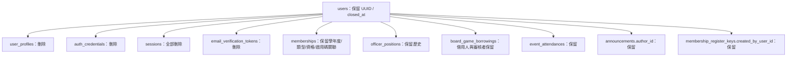

# 帳號註銷與管理邊界（Phase 3G）

## 稽核來源與關聯

來源：canonical schema、各 forward migration、auth/users/sessions Repository 與 Service、Email 驗證 RPC、Admin users/detail、settings 與驗證等待頁。遠端 `supabase migration list` 已確認套用至 `202609130002`；目前連結 project 為 `gcydchpuckbmctcjpokz`。未讀取真實使用者個資。

既有 User FK：Profile、credential、Session、membership、officer、borrowing（借用人及審核者）、attendance、announcement 均為 `ON DELETE NO ACTION`；驗證 token 為 CASCADE；啟用碼建立者為 SET NULL。User email unique；profile.user_id unique；Session token unique；驗證 hash unique。Membership 還有學年度／使用者開放資格唯一索引，借用有同使用者同桌遊未完成唯一索引。沒有帳號停權／刪除 UI；`usersRepository.deleteById` 是既有未使用 helper，不作為註銷流程。

## 決策與資料處理

只新增 `users.closed_at`：null 是可用帳號；非 null 是註銷與本次去識別交易已完成。不新增重複 status/anonymized_at flags，也不提供復原。

| 資料 | 註銷處理 |
| --- | --- |
| users.name | `已註銷使用者` |
| users.email | 隨機 UUID 的 `closed-…@account.invalid`，釋放原 Email unique；不含原 Email/hash |
| users.avatar / email_verified_at | null |
| Profile real_name / phone / student_id / school / department / grade | 整筆 Profile 刪除（含其 id、建立／更新時間） |
| password_hash | 憑證整筆刪除 |
| Session token / activity / expiry | 該帳號全部 Session 刪除 |
| 驗證 token_hash / timestamps | 該帳號全部驗證 token 刪除 |
| User UUID / created_at / updated_at / closed_at | 保留 tombstone 與事件時間 |
| 社員、幹部、借用、簽到、公告作者、啟用碼建立者 | 不變更或解除 FK，保留必要歷史 |

去識別不等於所有歷史匿名化：保留 UUID／社團紀錄仍可能間接識別，仍受資料保護與保存必要性要求。既有寄出信件、平台日誌、備份及使用者自行寫入公告的內容，不會被此交易搜尋或追溯清除；其他個資請求仍需人工依法處理。不得宣稱註銷即刪除所有副本。

阻擋：pending、approved、borrowed。允許：無借用，或只有 returned／rejected／cancelled。社員、曾任幹部、出席歷史不是 blocker；幹部接手安排屬社團維運事項，不新增禁止最後幹部註銷的隱藏規則。

## 安全與交易

`POST /api/users/me/closure` 從 cookie Session 取得身份，允許未驗證 Email 帳號自行註銷；嚴格 schema 只接受目前密碼及「註銷帳號」確認文字。Server 以現有 Argon2 驗證，不接受 client 的 userId/hash。沿用既有速率限制 primitive（5 次／15 分鐘，仍是 process-local，非分散式防護）。

Server 呼叫 `close_account(token, expected_hash)`；此 RPC 僅 service_role 可執行，不接受目標 UUID。DB 依 token 找帳號、取得 User row lock，再重新檢查 Session 到期／撤銷、核對重驗時的 credential hash，確認借用 blocker，接著清除資料與寫 tombstone。任何錯誤整筆 rollback。相同 token 再呼叫已失效，回正常 401，不重複操作。

新 Session、credential、profile、驗證 token，以及 open borrowing 寫入共用 User lock／closed guard。借用先 commit，註銷看到 blocker；註銷先 commit，晚到 Session／借用被拒絕。一般帳號更新不能恢復 closed User 或重填個資。既有 borrowing RPC 及 status model 保留，沒有 generic retry。

登入保留 timing-safe 密碼比對，再拒絕 closed user；Session 查詢亦拒絕 closed user。管理端先檢查 closed，再套既有「曾任幹部」授權規則；歷史職位不等於可重新登入。成功回應清除 cookie，UI 顯示成功後整頁回首頁，不 refresh 已失效身份。已經通過授權且執行中的其他請求不是可跨程序即時取消的工作；資料交易 guard 防止本次保護資料復活，下一次身份查核拒絕舊 Session。

## Admin 與 Self 分工

| 分類 | 欄位／行為 |
| --- | --- |
| Self 帳號設定 | 顯示名稱、avatar URL |
| Admin「編輯個人資料」 | 真實姓名、電話、學號、學校、系所、年級；closed User 不可編輯／重建 |
| 唯讀 | Email、驗證／建立／更新／註銷時間、User ID、帳號狀態；密碼/token 不展示 |
| 專用敏感操作 | Self 變更密碼、Self 註銷；Email 變更、Admin suspension、Admin 密碼重設延後 |
| 社團紀錄 | 社員／幹部保留原管理流程；detail 額外顯示借用／出席計數 |

Admin profile schema 只產出明確欄位，傳入 Email／verification／closed_at 不會持久化。Picker 不回傳 closed user；列表保留 tombstone 供歷史追查，不展示匿名內部 Email。沒有手動 verified checkbox。

未驗證帳號被既有 authenticated layout 導向等待驗證頁，所以該頁重用同一註銷元件，不放寬其他功能的 Email gate。成功不可復原；原 Email 可重新註冊成新 UUID，但不轉移原會員資格／歷史。

## 未來公開作者契約

Phase 3I 已建立最小 Public Profile 投影，詳見 [公開身份邊界](public-identity.md)；Reviews／Comments 尚未實作。未來公開作者投影必須只輸出必要公開欄位；closed user 固定顯示「已註銷使用者」、avatar=null，不輸出 email、Profile 或內部 tombstone email。文章／評論可保留作者 UUID 維持脈絡，不能用 User ID 查出先前個資。既有內容本身是否含個資須另行審查，不由作者名稱替換保證。

## Migration 與回退

新增 `202609140001_add_account_closure.sql`，未改已部署 migration。canonical snapshot 末尾明列此待部署增量。
遠端 dry-run 只列這一份，無 seeds／roles。**本輪尚未套用遠端**，localhost 目前連線的共享 DB 也尚未具備註銷 RPC。必須先套 migration，再發布 application；不能把未部署的 UI 測試當成實際可註銷。

獨立 PostgreSQL 18 位於 127.0.0.1:55439，database `phase3g_qa`，僅假資料。先載入既有 canonical baseline（本機補 Supabase 三角色），再執行新 migration。
`verification/verify-account-closure.sql` 以 rollback 驗證全狀態矩陣、PII 清除、歷史、token、權限、重複操作、原 Email 再註冊及注入錯誤回滾。
`verification/verify-account-closure-concurrency.mjs` 驗證雙連線競爭，只允許固定本機 QA DB，留下的假資料不會進 production。

回退只停用新增 UI／endpoint，保留 closed_at 與 auth guard；不可回退到會忽略 closed_at 的認證程式，也不能重新填回憑證／個資或 DROP tombstone 狀態。註銷是不可逆的資料操作，schema down migration 不能還原已清除個資。

鎖定與函式權限依據：[PostgreSQL row locks](https://www.postgresql.org/docs/current/explicit-locking.html)、[SECURITY DEFINER](https://www.postgresql.org/docs/current/sql-createfunction.html)。

## 開發階段驗證與人工 QA（套用前紀錄）

- RED：新增測試初次 0/8，缺少 lifecycle 實作而失敗；最終 npm test 529/529（baseline 504，新增 25）。
- 受影響功能組合測試 75/75；isolated SQL、注入錯誤 rollback、3 組真實並行交易通過。
- 全新 `phase3g_snapshot` 資料庫完整載入更新後 canonical schema，重跑 SQL verification 通過。
- lint、TypeScript、diff check 通過；production audit 0 vulnerabilities。
- 未提交、未部署、未套用遠端 migration，也未以真實帳號註銷測試。
- 瀏覽器連接器沒有可用 browser/tab；DOM 測試不代表實際視覺 PASS。

人工 QA（先使用已套 migration 的隔離資料庫與可丟棄帳號）：
1. 320/375px 與桌面開啟 Settings 註銷 Modal，檢查文字、欄位、按鈕換行與捲動。
2. 取消與錯誤密碼不改資料；有 pending/approved/borrowed 時顯示具體 blocker。
3. 僅歷史借用帳號註銷成功，回首頁，舊登入憑證／Cookie 無法恢復身份。
4. Admin 顯示已註銷身份、清除的個資與保留的社團歷史；不可編輯該 Profile。
5. 未驗證 Email 帳號可從等待驗證頁使用相同註銷流程。

## Phase 3G-1 帳號管理邊界補充

Admin 可透過獨立「編輯帳號資料」表單修改 `users.name` 與 `users.avatar`；沿用本人帳號設定的 `usersService.updateAccount` 與同一 schema。名稱去除前後空白後限制 1–50 字，沒有唯一性或保留名稱規則。Avatar 維持 URL，不新增上傳；允許 HTTP/HTTPS 且拒絕網址帳密，null 代表清除。共用 schema 嚴格拒絕 Email、驗證、密碼及 lifecycle 欄位。

帳號與個人資料各有獨立編輯入口。Closed account 隱藏兩個入口，Service 拒絕更新；既有 DB guard 保留。Email／驗證仍唯讀，沒有手動驗證 checkbox。註銷只精簡文案並使用 danger 按鈕，交易、blockers、Session 清除及 migration 不變。

## 2026-09-14 Final closure：遠端已套用

USER 授權後，dry-run 僅列 `202609140001_add_account_closure.sql`，無 seeds／roles。已使用 Supabase CLI db push 套用至 `gcydchpuckbmctcjpokz`；remote history 已包含 `202609140001`。上文尚未套用／待授權描述為開發當時紀錄，已由本節更新。Application 尚未部署。

Migration SHA-256：`A5A6DBCC3B6F06B4A8CD8C41D3315F1277988A7959647B915FDB477DBE71E994`，本次隔離驗證及 push 前後一致。`closed_at` 為 nullable timestamptz、無 default；RPC signature、SECURITY DEFINER、空 search_path 及 service-role-only execute boundary 通過，anon/authenticated 不可執行。遠端三個函式 body hash 與全新本機 canonical schema 相同。

遷移前後筆數一致：users/profile/credentials 各 19、sessions 33、verification tokens 21、memberships 13、officers 14、borrowings 6、attendance 0、announcements 1、register keys 153。Closed users 為 0。PostgREST 新欄位、active users、officer schema 與 Dashboard counts 皆 200。Schema cache reload not required.

本機 rollback SQL 驗證及並行交易 3/3 通過。未在共享遠端建立假帳號／社員／借用歷史，亦未註銷任何帳號；實際 browser closure round-trip 留待可丟棄帳號人工驗證。USER 已接受 UI，不代表 production browser smoke test 已執行。歷史 incident root cause 仍為 inconclusive。後續順序：deploy application → smoke test login/settings/admin。

最終回歸：556/556 tests PASS；lint、TypeScript、diff check PASS；production audit 0 vulnerabilities。Localhost 未登入 HTTP smoke：/login 200，/settings、/admin、/admin/users 與 synthetic user detail 307 至 /login；不代表登入後頁面已完成 browser QA。
# Phase 3K-S1 相容性補充

新應用將 Cookie 先做 SHA-256，再呼叫 `close_account_by_session_hash`，避免原始 Session 憑證進入 RPC。
新 RPC 保留原子交易、密碼版本確認、借用 blockers、鎖定與歷史保留；Stage A 暫時保留舊 RPC 供舊應用使用。
此相容 migration 尚未套用遠端；部署與舊 Session 失效順序見 [Session 憑證硬化](session-credential-hardening.md)。
